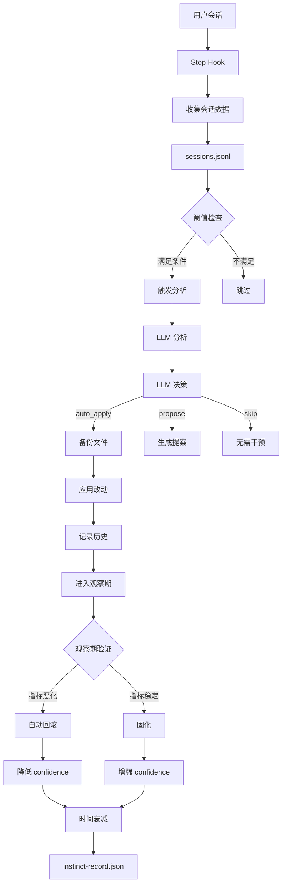

# 自动进化系统（Auto-Evolve）技术文档

> 全自动闭环进化系统 — 无需人工观察，持续自我优化

## 目录

1. [架构概览](#架构概览)
2. [核心模块](#核心模块)
3. [工作流程](#工作流程)
4. [配置说明](#配置说明)
5. [数据流](#数据流)
6. [决策引擎](#决策引擎)
7. [验证闭环](#验证闭环)
8. [风险控制](#风险控制)
9. [CLI 命令](#cli-命令)

---

## 架构概览

```
┌─────────────────────────────────────────────────────────────────────────────┐
│                         自动进化闭环系统                                     │
├─────────────────────────────────────────────────────────────────────────────┤
│                                                                             │
│   [用户会话]                                                                 │
│       ↓                                                                    │
│   [Hook 数据采集] ──→ sessions.jsonl                                         │
│       ↓                         ↓                                          │
│   [阈值预筛选] ───────────→ [触发分析]                                       │
│       ↓                                                                    │
│   [LLM 分析] ───────────→ [LLM 决策]                                         │
│       ↓                                                                    │
│   ├── auto_apply ──→ [直接修改文件] ──→ [备份] ──→ [记录历史] ──→ [观察期]   │
│   ├── propose ────→ [生成提案]                                              │
│   └── skip ───────→ [无需干预]                                              │
│       ↓                                                                    │
│   [观察期验证]                                                               │
│       ↓                                                                    │
│   ├── 指标恶化 ──→ [自动回滚] ──→ [降低 confidence]                          │
│   └── 指标稳定 ──→ [固化] ──→ [增强 confidence]                             │
│       ↓                                                                    │
│   [时间衰减] ──→ [旧数据置信度自动下降]                                      │
│                                                                             │
└─────────────────────────────────────────────────────────────────────────────┘
```

---

## 核心模块

### 1. 数据采集层（hooks/bin/）

| 文件 | 作用 | 触发时机 |
|------|------|----------|
| `collect-session.py` | 收集会话元数据 | Stop Hook |
| `collect-agent.py` | 记录 Agent 调用 | PostToolUse[Agent] |
| `collect-failure.py` | 记录工具失败 | PostToolUseFailure |
| `collect-skill.py` | 记录 Skill 使用 | PostToolUse[Skill] |

**会话数据结构（sessions.jsonl）**：

```json
{
  "session_id": "git-abc1234-2026-05-02",
  "timestamp": "2026-05-02T08:30:00+08:00",
  "mode": "solo",
  "duration_minutes": 45,
  "agents_used": ["backend-dev", "code-reviewer"],
  "agent_count": 3,
  "agent_distribution": {"backend-dev": 2, "code-reviewer": 1},
  "agent_success_rate": 0.9,
  "tool_failures": 2,
  "failure_types": {"permission_error": 1, "not_found_error": 1},
  "failure_tools": {"Read": 1, "Bash": 1},
  "git_files_changed": 5,
  "git_lines_added": 100,
  "git_lines_deleted": 20,
  "corrections": [],
  "rich_context": {
    "agent_stats": {...},
    "failure_stats": {...},
    "git_stats": {...}
  }
}
```

### 2. 分析层（evolve-daemon/analyzer.py）

```python
def aggregate_and_analyze(sessions: list[dict], config: dict, root: Path) -> dict:
    """
    分析维度:
    1. 纠正热点: 哪些 skill/agent 被用户纠正最多
    2. 失败模式: 哪种 tool 失败率最高
    3. 技能覆盖: 哪些场景缺少 skill 指导
    4. 质量趋势: 纠正率是否在改善
    """
```

**输出结构**：

```python
{
    "total_sessions": 10,
    "correction_hotspots": {"agent:backend-dev": 5, "skill:testing": 3},
    "correction_patterns": {...},
    "tool_failures": {"Read": 3, "Bash": 2},
    "skill_usage": {"testing": 5},
    "skill_override_rate": 0.2,
    "primary_target": "agent:backend-dev",
    "should_propose": True,
}
```

### 3. LLM 决策引擎（evolve-daemon/llm_decision.py）

**决策类型**：

| 决策 | 条件 | 行为 |
|------|------|------|
| `auto_apply` | 低风险 + confidence >= 0.8 | 直接修改文件 |
| `propose` | 高风险/新目标/多文件 | 生成提案 |
| `skip` | 数据不足 | 无需干预 |

**风险评估规则**：

```python
# 高风险模式（强制提案）
high_risk_patterns = ["permission", "credential", "security", "auth"]

# 低风险模式（可自动应用）
low_risk_patterns = ["comment", "format", "typo", "docs", "example"]

# 必须人工确认
require_human_review = ["security", "permission", "new_target", "multi_file"]
```

**决策数据结构**：

```python
{
    "action": "auto_apply",
    "reason": "Low risk + high confidence",
    "confidence": 0.85,
    "target_file": "agents/backend-dev.md",
    "suggested_change": "append: ## 新增提示\n...",
    "risk_level": "low",
    "id": "auto-20260502103000"
}
```

### 4. 自动应用（evolve-daemon/apply_change.py）

**改动类型**：

```python
# 精确替换
"old_text -> new_text"

# 行追加
"append: new content here"

# 行删除
"delete: pattern to remove"

# 正则替换
"regex: old_pattern -> new_pattern"
```

**应用流程**：

1. 备份原文件到 `.claude/data/backups/`
2. 读取当前内容
3. 应用改动
4. 记录提案历史到 `proposal_history.json`
5. 更新 instinct 记录

### 5. 观察期验证（evolve-daemon/rollback.py）

**验证指标**：

| 指标 | 含义 | 回滚条件 |
|------|------|----------|
| `task_success_rate` | 成功率 | < 0.8 或下降 > 10% |
| `failure_rate` | 失败率 | 上升 > 10% |
| `correction_rate` | 纠正率 | 上升 > 20% |

**观察期配置**：

- 默认 7 天
- 样本 < 5 继续观察
- 样本 >= 10 且稳定 → 固化

### 6. 时间衰减（evolve-daemon/instinct_updater.py）

**衰减算法**：

```
weight = 0.5 ^ (age_days / half_life_days)

示例:
- 90 天后: weight = 0.5 (置信度减半)
- 180 天后: weight = 0.25 (置信度为原来的 1/4)
```

**半衰期调整**：

- reinforcement_count >= 3 → 半衰期延长 50%
- reinforcement_count >= 5 → 半衰期延长 100%

**置信度边界**：

- 最低值: 0.1（不会低于此值）
- 最高值: 0.95（不会超过此值）

---

## 工作流程

### 完整闭环流程



### 数据采集流程

```
Stop Hook 触发
    ↓
读取 .session_start 文件（获取开始时间、模式）
    ↓
聚合 agent_calls.jsonl（统计 agents 使用情况）
    ↓
聚合 failures.jsonl（统计失败类型、工具）
    ↓
执行 git diff（统计文件变更）
    ↓
构建 session 对象
    ↓
写入 sessions.jsonl
    ↓
返回收集结果
```

---

## 配置说明

**配置文件**: `evolve-daemon/config.yaml`

### 1. 触发阈值

```yaml
thresholds:
  min_new_sessions: 5                # 最少新会话数
  min_same_pattern_corrections: 3     # 同一模式被纠正次数
  max_hours_since_last_analyze: 6     # 最长分析间隔
  min_failure_count: 5               # 单会话失败数阈值
  min_failure_type_count: 3          # 同类型失败阈值
  min_failure_rate: 0.5               # Agent 成功率阈值
```

### 2. 决策配置

```yaml
decision:
  enabled: true
  auto_apply_threshold: 0.8          # 自动应用置信度阈值
  high_risk_threshold: 0.5           # 高风险阈值

  require_human_review:              # 必须人工确认
    - "security"
    - "permission"
    - "new_target"
    - "multi_file"

  risk_rules:
    high_risk_patterns:             # 高风险关键词
      - "permission"
      - "credential"
      - "security"
    low_risk_patterns:               # 低风险关键词
      - "comment"
      - "format"
      - "typo"
      - "docs"
```

### 3. 时间衰减

```yaml
decay:
  half_life_days: 90                # 半衰期
  decay_floor: 0.1                  # 最低置信度
  min_reinforcement: 3             # 延长半衰期的验证次数
  reinforcement_bonus: 0.05         # 每次验证增加
  max_confidence: 0.95              # 最高置信度
```

### 4. 观察期验证

```yaml
observation:
  days: 7                           # 观察期天数
  check_interval_hours: 24          # 检查间隔

  metrics:
    min_success_rate: 0.8           # 最低成功率
    max_correction_rate: 0.2        # 最高纠正率
    max_failure_rate_delta: 0.1     # 最大失败率增幅
```

### 5. 安全限制

```yaml
safety:
  max_proposals_per_day: 3        # 每天最大提案数
  auto_close_days: 7                # 未处理提案关闭天数

  breaker:
    max_consecutive_rejects: 3     # 连续拒绝次数
    pause_days: 30                 # 暂停天数
    max_rollbacks_per_week: 5      # 每周最大回滚数
```

---

## 数据流

### 输入数据

| 文件 | 来源 | 内容 |
|------|------|------|
| `sessions.jsonl` | collect-session.py | 会话元数据 |
| `agent_calls.jsonl` | collect-agent.py | Agent 调用记录 |
| `failures.jsonl` | collect-failure.py | 工具失败记录 |
| `instinct-record.json` | instinct_updater.py | 本能记录 |

### 输出数据

| 文件 | 用途 |
|------|------|
| `proposals/*.md` | 改进提案 |
| `proposal_history.json` | 提案历史 |
| `analysis_state.json` | 分析状态 |
| `instinct-record.json` | 更新后的本能记录 |
| `.claude/data/backups/*` | 文件备份 |

### 提案历史结构

```json
{
  "id": "auto-20260502103000",
  "action": "auto_apply",
  "reason": "Low risk + high confidence",
  "target_file": "agents/backend-dev.md",
  "suggested_change": "append: ## 新增提示",
  "risk_level": "low",
  "confidence": 0.85,
  "status": "applied",
  "applied_at": "2026-05-02T10:30:00",
  "observation_end": "2026-05-09T10:30:00",
  "backup_path": ".claude/data/backups/auto-xxx_agent.md",
  "baseline_metrics": {
    "success_rate": 0.9,
    "failure_rate": 0.1,
    "correction_rate": 0.1
  },
  "rollback_triggers": [],
  "rolled_back_at": null,
  "consolidated_at": null
}
```

---

## 决策引擎

### 决策流程图

```
输入: sessions, analysis, config
    ↓
规则检查:
    ↓
├── 安全相关? ──→ 强制 propose
├── 新目标? ────→ 强制 propose
├── 高风险模式? ──→ 强制 propose
└── 通过 ↓
    ↓
LLM 评估:
    ↓
├── confidence >= 0.8 && risk_level == "low" → auto_apply
├── 新目标/高风险 → propose
└── 数据不足 → skip
    ↓
输出决策
```

### LLM Prompt 示例

```
你是 AI 工程规范进化助手。分析使用数据，判断是否需要改进 Agent/Skill/Rule 定义。

决策选项：
1. auto_apply: 置信度极高，风险极低，可以自动应用
2. propose: 需要人工 Review，生成提案
3. skip: 数据不足以支撑建议

决策规则：
- 低风险（comment/format/typo/docs） + 高置信（>= 0.8）→ auto_apply
- 新目标、未验证的改动 → propose
- 高风险（安全/权限/新目标/多文件）→ propose
- 数据不足以支撑明确建议 → skip

输出格式（JSON）：
{
  "action": "auto_apply" | "propose" | "skip",
  "reason": "决策理由",
  "confidence": 0.0-1.0,
  "target_file": "agents/xxx.md 或 skills/xxx/SKILL.md",
  "suggested_change": "具体改动内容",
  "risk_level": "low" | "medium" | "high"
}
```

---

## 验证闭环

### 观察期验证流程

```
Day 0: 应用改动
    ↓
Day 1-7: 收集指标
    ↓
Day 7: 评估
    ↓
├── 指标恶化 → 回滚 → 降低 confidence
└── 指标稳定 → 固化 → 增强 confidence
```

### 回滚触发条件

```python
def should_rollback(metrics, baseline, config):
    # 成功率下降 > 10%
    if success_rate_delta < -0.10:
        return True

    # 纠正率上升 > 20%
    if correction_rate > baseline * 1.20:
        return True

    # 失败率上升 > 10%
    if failure_rate > baseline * 1.10:
        return True

    return False
```

### 熔断器逻辑

```python
# 最近一周回滚 >= 5 次 → 暂停系统
if rollbacks_last_week >= 5:
    pause_system(days=30)

# 同一 target 连续被拒 >= 3 次 → 暂停该 target
if consecutive_rejects >= 3:
    pause_target(days=30)
```

---

## 风险控制

### 三层防护

| 层级 | 机制 | 作用 |
|------|------|------|
| **规则层** | 高风险模式检测 | 阻止危险改动 |
| **LLM 层** | 置信度评估 | 确保改动质量 |
| **指标层** | 观察期验证 | 快速发现回滚 |

### 文件备份

- 备份目录: `.claude/data/backups/`
- 备份命名: `{decision_id}_{filename}`
- 恢复机制: `apply_change.py` → `rollback_proposal()`

### 数据验证

```python
def validate_session(session):
    # 必须有 session_id
    # 必须有 timestamp
    # duration_minutes 必须 >= 0
    # corrections 格式正确
    # failure_types 格式正确
```

---

## CLI 命令

### 基本命令

```bash
# 检查触发条件
cd evolve-daemon && python3 daemon.py check

# 执行完整闭环
cd evolve-daemon && python3 daemon.py run

# 查看系统状态
cd evolve-daemon && python3 daemon.py status

# 查看统计
cd evolve-daemon && python3 daemon.py stats

# 运行数据验证
cd evolve-daemon && python3 daemon.py validate
```

### Instinct 命令

```bash
# 添加 pattern
python3 -m evolve_daemon.instinct_updater add \
  --pattern "检测到多纠正热点" \
  --correction "见提案文件" \
  --confidence 0.5

# 增强置信度
python3 -m evolve_daemon.instinct_updater promote --id auto-xxx --delta 0.1

# 应用时间衰减
python3 -m evolve_daemon.instinct_updater decay

# 查看统计
python3 -m evolve_daemon.instinct_updater stats
```

### Rollback 命令

```bash
# 检查回滚
cd evolve-daemon && python3 rollback.py check

# 查看健康状态
cd evolve-daemon && python3 rollback.py health --id proposal-xxx

# 手动回滚
cd evolve-daemon && python3 apply_change.py rollback --id proposal-xxx --reason "Manual rollback"
```

---

## 文件结构

```
.
├── evolve-daemon/
│   ├── config.yaml           # 统一配置
│   ├── daemon.py             # 主循环
│   ├── analyzer.py            # 数据分析
│   ├── llm_decision.py        # LLM 决策引擎
│   ├── apply_change.py        # 自动应用
│   ├── rollback.py            # 自动回滚
│   ├── instinct_updater.py    # 时间衰减
│   ├── validator.py          # 数据验证
│   └── proposer.py            # 提案生成
│
├── hooks/bin/
│   ├── collect-session.py     # 会话采集
│   ├── collect-agent.py       # Agent 调用记录
│   ├── collect-failure.py     # 失败记录
│   └── collect-skill.py       # Skill 使用记录
│
├── instinct/
│   └── instinct-record.json   # 本能记录
│
└── .claude/data/
    ├── sessions.jsonl         # 会话日志
    ├── agent_calls.jsonl       # Agent 调用
    ├── failures.jsonl          # 失败记录
    ├── proposal_history.json    # 提案历史
    ├── analysis_state.json      # 分析状态
    └── backups/                # 文件备份
```

---

## 版本历史

| 版本 | 日期 | 变更 |
|------|------|------|
| 1.0 | 2026-05-02 | 初始版本，全自动闭环实现 |