# Mermaid 图表技能

Mermaid 是一种基于文本的图表生成工具，通过简单的声明式语法创建各种类型的图表。本技能提供 Mermaid 图表的编写指南、最佳实践和常用示例。

## 何时使用

在以下场景中应优先使用 Mermaid 图表：

1. **技术文档编写** — 需要在 Markdown 文档中嵌入图表时，Mermaid 可与文档源码无缝集成
2. **架构设计** — 描述系统组件、模块交互和数据流向
3. **流程建模** — 展示业务流程、算法流程或用户操作流程
4. **API 文档** — 绘制请求响应时序和接口依赖关系
5. **数据库设计** — 表达实体关系和数据模型
6. **项目管理** — 创建甘特图展示项目里程碑和进度
7. **团队协作** — 通过代码版本控制图表，便于协作和审阅

## 支持的图表类型

Mermaid 支持多种图表类型，以下按使用场景分类说明。

### 流程图（Flowchart）

流程图用于展示业务流程、算法逻辑或决策路径。

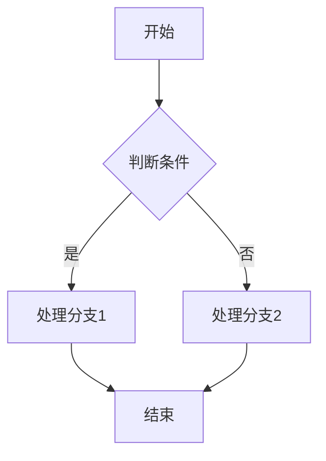

**常用布局方向**：

- `TB` — 从上到下（Top-Bottom）
- `BT` — 从下到上（Bottom-Top）
- `LR` — 从左到右（Left-Right）
- `RL` — 从右到左（Right-Left）

**常用节点形状**：

- `[ ]` — 矩形（普通节点）
- `( )` — 圆角矩形（ rounded rectangle）
- `{ }` — 菱形（判断/条件）
- `[[ ]]` — 圆柱形（数据库/存储）
- `[/ /]` 或 `[\\ \\]` — 梯形（输入/输出）

### 时序图（Sequence Diagram）

时序图用于展示对象之间的交互顺序和时间关系。

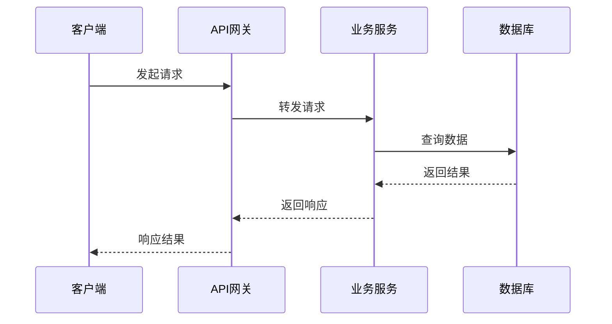

**常用语法元素**：

- `participant` — 定义参与者
- `->>` — 实线箭头（异步消息）
- `-->>` — 虚线箭头（响应）
- `activate` / `deactivate` — 激活与销毁
- `loop` — 循环区域
- `alt` / `else` — 条件分支

### 类图（Class Diagram）

类图用于展示面向对象设计中的类、接口及其关系。

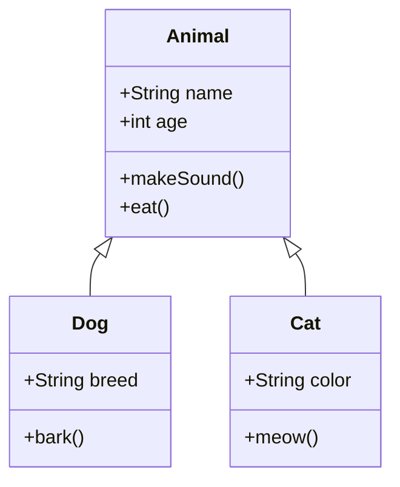

**关系类型**：

- `<|--` — 继承（Inheritance）
- `*--` — 组合（Composition）
- `o--` — 聚合（Aggregation）
- `-->` — 关联（Association）
- `--` — 实线（无箭头）
| `-->` | 依赖（Dependency） |

### 状态图（State Diagram）

状态图用于描述对象或系统的状态转换过程。

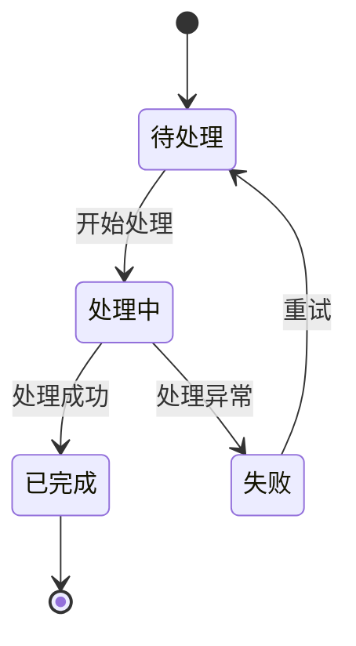

### 实体关系图（ER Diagram）

ER 图用于数据库设计，展示实体及其关系。

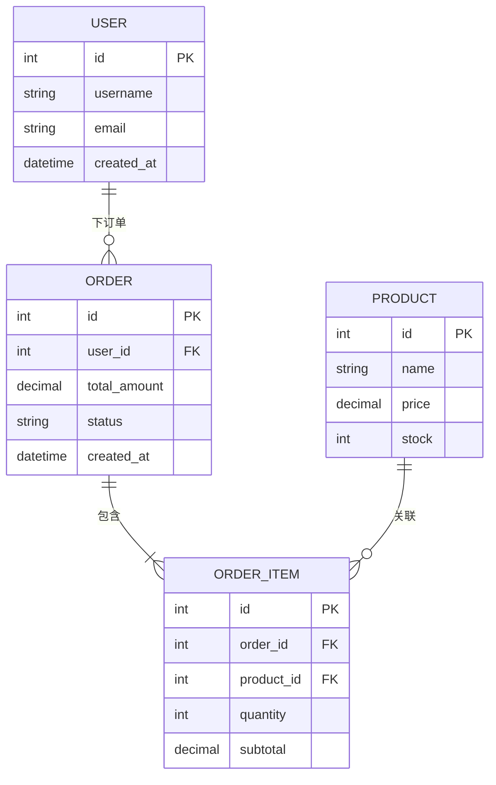

**关系基数表示**：

- `||` — 恰好一个（Exactly one）
- `|{` — 一个或多个（One or more）
- `o{` — 零个或多个（Zero or more）
- `||--o{` — 零个或一个到多个

### 甘特图（Gantt Chart）

甘特图用于项目计划和时间管理。

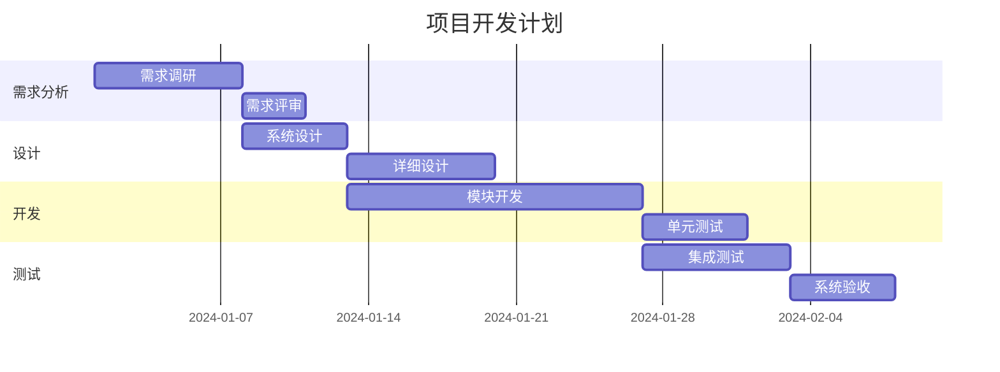

### 饼图（Pie Chart）

饼图用于展示数据占比和分布。

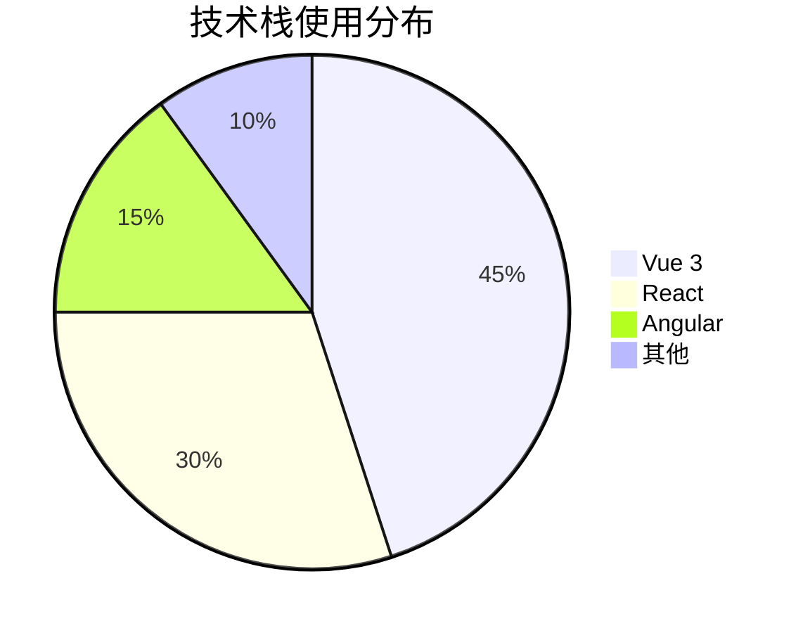

### 用户旅程图（User Journey）

用户旅程图用于展示用户在系统中的操作路径和体验。

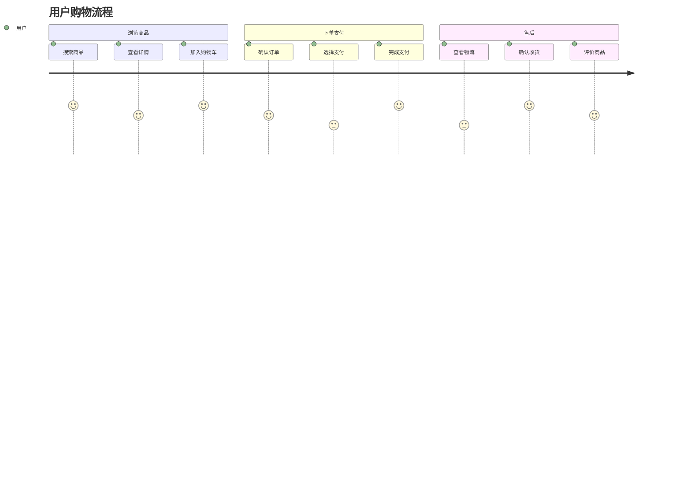

### Git 分支图（Git Graph）

Git 分支图用于可视化展示代码分支策略和合并历史。

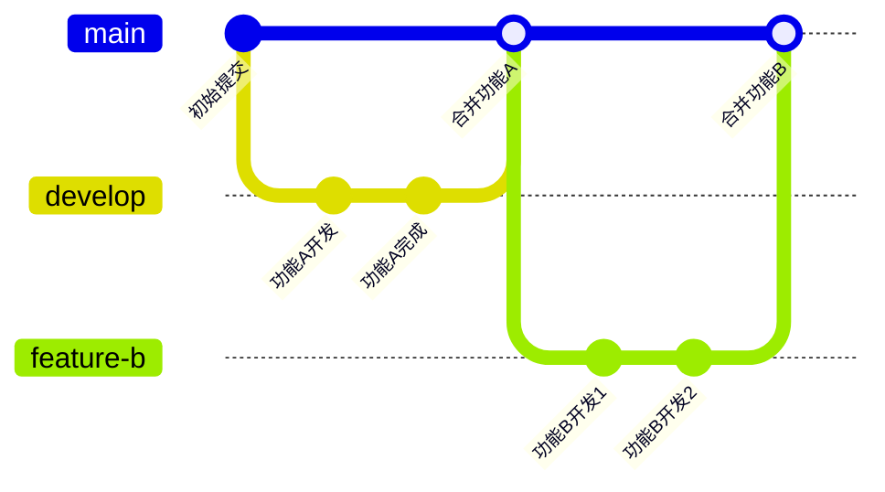

## 使用示例

### 复杂架构图示例

以下是一个典型的微服务架构图：

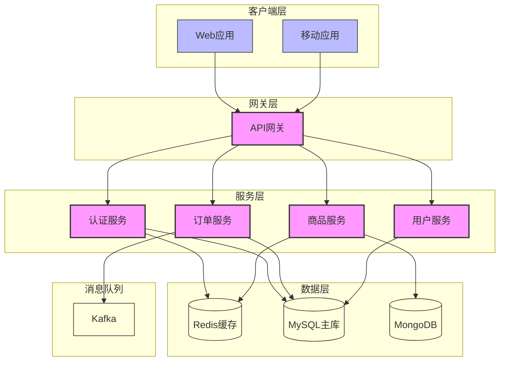

### API 交互时序图

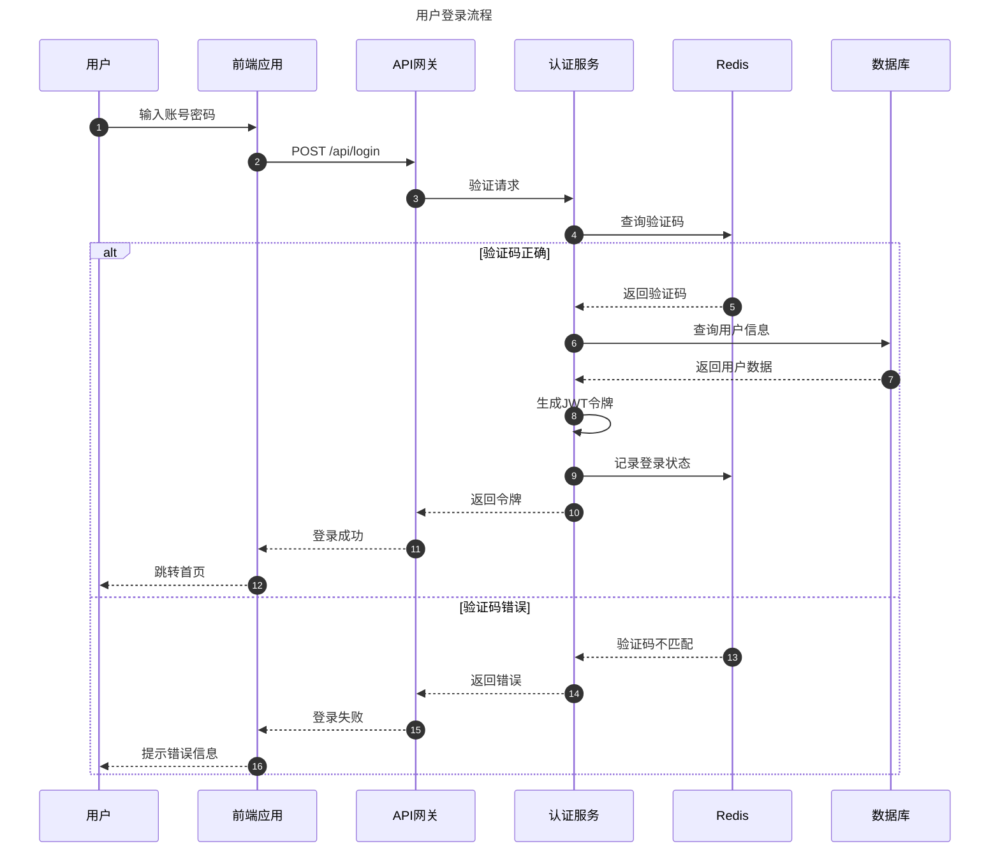

### 数据库 ER 图

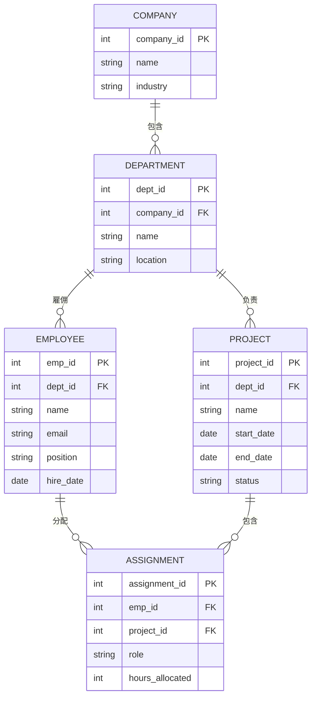

## 最佳实践

### 图表设计原则

1. **清晰优先** — 图表应以传达信息为首要目标，避免过度装饰
2. **层次分明** — 使用子图（subgraph）组织复杂图表，保持逻辑分组
3. **命名规范** — 节点和边的标签应简洁明了，使用中文或中英文结合
4. **颜色运用** — 适当使用颜色区分不同类型的内容，但不要过度使用
5. **保持简洁** — 单个图表建议控制在 20 个节点以内，超出则考虑拆分

### 代码组织建议

1. **版本控制** — 将 Mermaid 代码纳入 Git 版本控制，便于追踪变更
2. **复用定义** — 频繁使用的样式可通过 `classDef` 定义后复用
3. **模块化** — 复杂图表拆分为多个子图，通过引用关系组织
4. **注释说明** — 为复杂的图表逻辑添加注释，便于后续维护

### 渲染环境

1. **Markdown 编辑器** — 大多数现代 Markdown 编辑器支持 Mermaid 预览
2. **在线编辑器** — Mermaid Live Editor（https://mermaid.live/）提供实时预览
3. **文档工具** — Notion、Obsidian、Typora 等均支持 Mermaid
4. **代码托管** — GitHub README 和 Issues 原生支持 Mermaid 渲染
5. **前端集成** — 可通过 mermaid.js 库在网页中渲染图表

### 性能注意事项

1. **避免过度连接** — 节点间的连线应尽量简化，避免交叉混乱
2. **适当使用别名** — 节点名称过长时使用别名简化渲染
3. **分页展示** — 超大型图表考虑拆分为多个子图分页展示

## 参考资料

- **Mermaid 官方文档**：https://mermaid.js.org/
- **Mermaid Live Editor**：https://mermaid.live/
- **Mermaid GitHub 仓库**：https://github.com/mermaid-js/mermaid
- **Mermaid 语法参考**：https://mermaid.js.org/intro/syntax-reference.html
- **Mermaid 示例库**：https://mermaid.js.org/examples/

## 相关技能

- **lark-whiteboard** — 飞书画板图表绘制
- **architecture-design** — 系统架构设计
- **database-designer** — 数据库设计

---

## 进化记录

_此章节由维护者按需更新，记录从实际任务执行中学到的经验和最佳实践。_

### 2025-04-26 — 初始版本

- 创建 Mermaid 图表技能文档
- 包含 9 种图表类型的语法说明和示例
- 添加最佳实践和参考资料